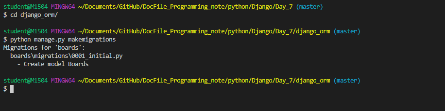

# Review


 

장고 다운


장고 기본 설정 파일 만들기


세팅즈 파일 설정


앱 만들기 저기에 + 앱 이름


### urls.py 먼저 만지기  위에는 config 아래는 app 이름이였던 boards

```python
from django.urls import path
from . import views
urlpatterns =[
	path('',views.index)
]
```


### boards.views

```python
from django.shrotcuts import render

def index(request):
    return render(request, "boards.html")
	
```


### templates>boards>boards.html

```html
<h1>
    index page
</h1>
```


### settings.templates

```python
'DIRS':[os.path.join(BASE_DIR,"config","templates")]
# templates가 있는 위치까지 넣어줘야 함.
```


### config.templates

```python
<!DOCTYPE html>
<html lang="en">
<head>
    <meta charset="UTF-8">
    <meta name="viewport" content="width=device-width, initial-scale=1.0">
    <meta http-equiv="X-UA-Compatible" content="ie=edge">
    <title>Document</title>
    <link rel="stylesheet" href="https://stackpath.bootstrapcdn.com/bootstrap/4.3.1/css/bootstrap.min.css" integrity="sha384-ggOyR0iXCbMQv3Xipma34MD+dH/1fQ784/j6cY/iJTQUOhcWr7x9JvoRxT2MZw1T" crossorigin="anonymous">
</head>
<body>
	
    

    <script src="https://code.jquery.com/jquery-3.3.1.slim.min.js" integrity="sha384-q8i/X+965DzO0rT7abK41JStQIAqVgRVzpbzo5smXKp4YfRvH+8abtTE1Pi6jizo" crossorigin="anonymous"></script>
    <script src="https://cdnjs.cloudflare.com/ajax/libs/popper.js/1.14.7/umd/popper.min.js" integrity="sha384-UO2eT0CpHqdSJQ6hJty5KVphtPhzWj9WO1clHTMGa3JDZwrnQq4sF86dIHNDz0W1" crossorigin="anonymous"></script>
    <script src="https://stackpath.bootstrapcdn.com/bootstrap/4.3.1/js/bootstrap.min.js" integrity="sha384-JjSmVgyd0p3pXB1rRibZUAYoIIy6OrQ6VrjIEaFf/nJGzIxFDsf4x0xIM+B07jRM" crossorigin="anonymous"></script>
</body>
</html>
```


부트 스트랩 사용


부트 스트랩 사이트에서 documentation 으로 들어가서 css 는 헤더 안쪽에 js는 바디 안쪽에 사용한다.  그 외에 다른 기능을  사용하고 싶다면, 좌측에 보면 component 를 클릭해주면 많은 예시들이 있따.


boards.tmeplates > index.html

```python



<h1> index page </h1>


```


# 20191114

### MTV(spring은 MVC)

:모델 템플릿 뷰


## DB의 기본 구조

### Quary

: 데이터를 질의 하는 조회하는 명령어

### DB

: 체계화된 데이터의 모임

### 스키마

: DB자료의 구조, 표현방법, 관계 정의한 구조

### 테이블

- 필드: 컬럼
- 레코드: 데이터


## ORM(Object Relataional Mapping)

### ORM의 장점 

1. SQL을 몰라도 DB에 접근이 가능하다.
2. 코드의 가독성이 좋아진다.
3. 생산성이 좋아진다.
4. ERD( Entity Relationship Diagram )를 보는 것에 의존도가 낮아질 수 있다.


### ORM의 단점

1. 모든 것을 커버가 안된다.
2. 프로젝트 규모가 커지면, 난이도가 올라간다. 잘 못된 설정을 했을 경우 유지 보수에 어려움을 가질 수 있다.


 ### Model

모델은 단일 데이터에 대한 정보를 가지고 있어요. 필수적인 필드와 데이터에 대한 정보를 포함한다. 각각의 모델은 각각의 단일 DB 테이블과 매핑이된다. 사용자가 저장하는 데이터들의 필수적인 필드(컬럼) 동작을 포함. 


### 실습 

 boards.medel.py 

```python
from django.db import models

# Create your models here.
class Boards(models.Model):
    title=models.CharField(max_length=10)
    content = models.TextField()
    created_at=models.DateTimeField(auto_now_add=True)
    #auto_now_add 해당 데이터가 생성을 할 때 자동으로 시간을 만들어줌.

    
```

타이핑을 해주고 이번에는 BASH에서 


```
python manage.py makemigrations
```

라고 입력을 해주면 아래와 같이 나오는 것을 볼 수 있다. 



확인 ㄱㄱ 이게 DB를 만들기 전에 사전에 하는 것. 이제 명세서 폼이 포함된 종이가 완성!!


요레 생겼네.  그리고 수정을 할 경우가 생길 수 있기때문에 아래의 코드를 넣어줬다.

```
 updated_at = models.DateTimeField(auto_now=True)
    #auto_now 해당 데이터가 수정을 할 때 자동으로 시간을 만들어줌.
```


만약 구조를 보고싶다면

```
python manage.py sqlmigrate boards 0001(migration에서 파일명에 숫자를 쳐준다.)
```


아래의 commit전의 코드를 보면 위에서 설정한 column 을 볼 수 있다. 그리고 적용이 되어 있느지 아닌지 알려면 아래의 코드를 치면 된다.

```
python manage.py showmigrations
```


그래서 적용을 하러면

```
python manage.py migrate
```


하고 다시 확인을 하면


위와 다르게 X표가 쳐 진것을 확인 할 수 있다. 참고로 X는 적용이 되었다는 것이다.


review

변경순서

1. models.py 를 작성
2. makemigrations : migration
3. ???


위의 과정이 끝이 나면 db.sqlite3 이 생긴 것을 볼 수 있다. 저것을 보려고 하자....


요런게 보이고  우측의 밑줄이 그어진 부분을 클릭하면


다깨진다... 그래서 우리는 


>  https://www.sqlite.org/download.html **** 


요기를 들어가서 sqlite를 다운받고 인스톨 까지 받아야한다.그래서 다운 받고  

```
1. vim ~/.bashrc 에 들어가서
	alias sqlite="c:/sqlite/sqlite3.exe" 라고 경로를 설정을 해준다.

2. source ~/.bashrc
3. sqlite 타이핑을 해주면
```


.table 테이블을 확인하는 명령어


이제 테이블을 설정하는 멸령어를 shell에서 진행을 해보겠습니다.


```
python manage.py shell

from boards.models import Boards 

Boards.objects.all() 

<QuerySet []>
```


쉘을 실행 > boards.models 에 있는 것을 Boards에 입력 > 그리고 Boards.objects를 전부 보내주는 명령어 까지. 현재 비어있는 것을 확인 할 수 있습니다.


**1번째 방법**

```
boards = Boards()
#title 설정
boards.title="first" 
#content에 들어갈 내용 입력
boards.content="django!!!!"
#저장
boards.save()
#출력
boards
#결과
<Boards: Boards object (1)>
```


**2번째 방법**

```
boards = Boards(title="second",content="django")

boards.save()

boards
<Boards: Boards object (2)>
```


**3번째 방법**

```
Boards.objects.create(title="third", content="django3")
#위의 방식은 boards.save() 생략할 수 있다.
<Boards: Boards object (3)>
```


**1.데이터 객체를 만드는 3가지 방법**

1. boards = Boards()
2. boards.title = "값"
3. boards.save()

**2. 두번째 방식**

1. board =Board(title="값",content-"값")
2. boards.save()

**3. 세번쩨 방식**

1. boards = Board.objects.create(title="값",content="값") 